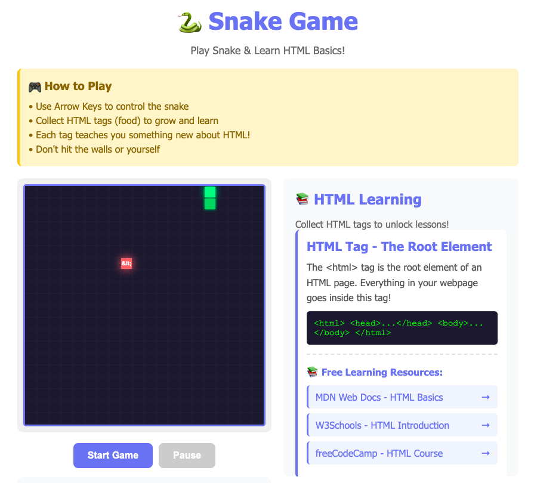
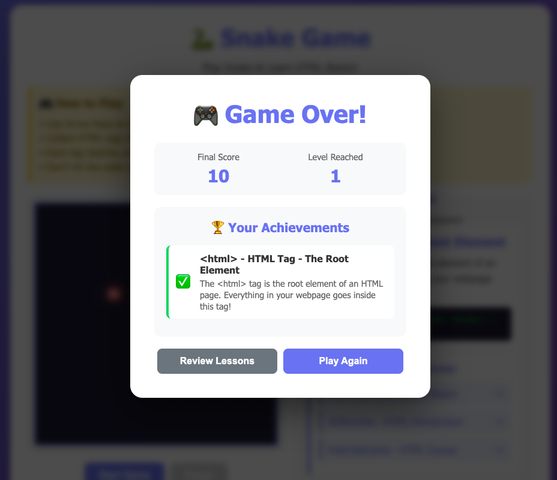

# 🐍 Snake Game - Learn HTML Basics

An **AI-assisted educational Snake game** built using AI to design and deploy interactive gameplay that teaches HTML fundamentals in a fun, hands-on way.
Players collect HTML tags during gameplay, unlocking explanations, code examples, and curated learning resources from **MDN**, **W3Schools**, and **freeCodeCamp**.


## 🎯 Purpose

This project was created to make learning HTML basics more enjoyable and interactive. Instead of reading dry documentation, learners can:

- **Play a fun game** while learning essential HTML tags
- **Collect HTML tags** as game objectives, with each tag unlocking educational content
- **Access curated learning resources** from trusted platforms like MDN, W3Schools, and freeCodeCamp
- **Track their progress** through scores, levels, and achievements
- **Learn by doing** in an engaging, gamified environment

### Why This Approach?

Traditional learning methods can be overwhelming for beginners. This game:
- ✅ Reduces learning anxiety through play
- ✅ Provides immediate visual feedback
- ✅ Breaks down complex topics into digestible pieces
- ✅ Motivates continued learning through progression
- ✅ Offers additional resources for deeper understanding

## 🎮 How It Works

### Gameplay Mechanics
1. **Control the snake** using arrow keys (↑ ↓ ← →)
2. **Collect HTML tags** (represented as food items)
3. **Grow your snake** and increase your score
4. **Unlock lessons** about each HTML tag you collect
5. **Level up** every 3 tags - the game gets faster!
6. **Avoid** hitting walls or yourself

### Educational Features
Each time you collect an HTML tag, you learn:

- **Tag Name** - The actual HTML tag syntax
- **Description** - What the tag does and when to use it
- **Code Example** - Real-world implementation
- **Learning Resources** - 3 curated free resources for deeper learning

### Tags Covered
The game teaches 10 fundamental HTML tags:

1. `<html>` - The Root Element
2. `<head>` - Metadata Container
3. `<body>` - Main Content Container
4. `<h1>` - Heading Tags
5. `<p>` - Paragraph Tag
6. `<a>` - Anchor/Link Tag
7. `` - Image Tag
8. `<div>` - Division/Container Tag
9. `<ul>` - Unordered List
10. `<button>` - Button Element

## 🚀 Features

### Game Features
- 🎯 Classic snake mechanics with smooth controls
- 📊 Real-time score tracking
- 🏆 Achievement system showing tags learned
- 📈 Progressive difficulty (speed increases with levels)
- ⏸️ Pause/Resume functionality
- 🎨 Modern, colorful UI with animations
- 📱 Responsive design (works on desktop and mobile)

### Educational Features
- 📚 10 HTML tags with detailed explanations
- 💡 Code examples for each tag
- 🔗 30 curated free learning resources
- ✅ Achievement tracking
- 📖 Persistent learning panel
- 🎓 Review mode after game over

## 🛠️ Technical Implementation

### Technologies Used
- **HTML5** - Structure and Canvas API for game rendering
- **CSS3** - Styling, animations, and responsive design
- **Vanilla JavaScript** - Game logic and interactivity

### Key Components

#### 1. Game Engine
```javascript
// Core game loop using setInterval
// Canvas rendering for smooth graphics
// Collision detection system
// Dynamic difficulty scaling
```

#### 2. Educational System
```javascript
// Tag database with descriptions and resources
// Learning card generation
// Achievement tracking
// Resource link management
```

#### 3. UI/UX Features
```javascript
// Responsive layout with flexbox
// CSS animations for smooth transitions
// Modal system for game over screen
// Scrollable learning panel
```

### File Structure
```
snake-html-learning.html
├── HTML Structure
│   ├── Game canvas
│   ├── Control buttons
│   ├── Stats display
│   ├── Learning panel
│   └── Game over modal
├── CSS Styling
│   ├── Layout & responsive design
│   ├── Animations
│   ├── Component styles
│   └── Color scheme
└── JavaScript Logic
    ├── Game mechanics
    ├── Canvas rendering
    ├── Educational content
    └── Event handlers
```


## Installation & Deployment

### Local Usage
1. **Download** the `index.html` file
2. **Double-click** to open in any modern web browser
3. **Start playing** - No installation required!

### Web Deployment

#### GitHub Pages
1. Fork this repository
2. Go to Settings → Pages
3. Select main branch as source
4. Your game will be live at `https://yourus.github.io/snake-html-learning/`

#### Netlify
1. Drag and drop the HTML file to [Netlify Drop](https://app.netlify.com/drop)
2. Get instant deployment URL
3. Share with students!


## Usage in Education

### For Teachers
- **Classroom Activity** - Use as an icebreaker for HTML lessons
- **Homework Assignment** - Students play and document what they learned
- **Assessment Tool** - Check understanding through gameplay
- **Flipped Classroom** - Assign as pre-lesson introduction

### For Self-Learners
- **Start Your Journey** - First step into web development
- **Break Time Learning** - Learn during short breaks
- **Reinforce Knowledge** - Review HTML basics playfully
- **Share Progress** - Screenshot achievements to track learning

## Customization

The game is built with a single HTML file, making it easy to customize:

### Add More Tags
```javascript
// Add to the htmlTags array
{
    name: '&lt;span&gt;',
    title: 'Span Tag - Inline Container',
    description: 'Your description here',
    example: 'Your code example',
    resources: [
        { name: 'Resource Name', url: 'https://...' }
    ]
}
```

### Change Colors
```css
/* Modify the color scheme in the <style> section */
--primary-color: #667eea;
--secondary-color: #764ba2;
```

### Adjust Difficulty
```javascript
// Change initial speed and speed increment
let speed = 150; // Lower = faster (default: 150)
speed = Math.max(50, speed - 15); // Difficulty increase rate
```


### Learning Resources Featured
- [MDN Web Docs](https://developer.mozilla.org/) - Comprehensive web development documentation
- [W3Schools](https://www.w3schools.com/) - Tutorials and references
- [freeCodeCamp](https://www.freecodecamp.org/) - Free coding curriculum
- [Khan Academy](https://www.khanacademy.org/) - Educational videos and exercises
- [Codecademy](https://www.codecademy.com/) - Interactive learning platform
- [Web.dev](https://web.dev/) - Google's web development guides
- [HTML Dog](https://htmldog.com/) - HTML tutorials
- [CSS-Tricks](https://css-tricks.com/) - Web design articles
- [JavaScript.info](https://javascript.info/) - Modern JavaScript tutorial

### Inspiration
This project was inspired by the need to make web development education more accessible and enjoyable for beginners worldwide.

## 📧 Contact & Support

- **Issues**: Open an issue on GitHub
- **Discussions**: Use GitHub Discussions for questions
- **Feedback**: I would love to hear how you're using this in education!

## Roadmap


## 📸 Screenshots

### Game Interface
# Screenshot of Game 



### Learning Panel


### Achievement Screen


---

## Show Your Support

If this project helped you learn HTML or you're using it in education, please:
- ⭐ Star this repository
- 🍴 Fork it for your own use
- 📢 Share it with other learners
- 💬 Provide feedback


**Made with ❤️ for learners everywhere**

*Happy Coding! 🚀*
